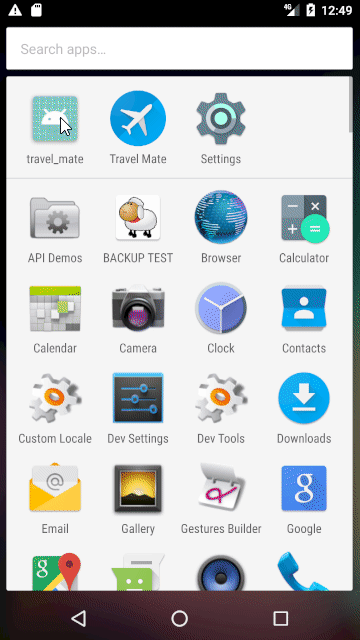

# Splash Screen

* [This Activity already has an action bar supplied by the window decor](https://stackoverflow.com/questions/26515058/this-activity-already-has-an-action-bar-supplied-by-the-window-decor)
* [Android Status Bar transparent when using AppTheme.NoActionBar](https://stackoverflow.com/questions/37616517/android-status-bar-transparent-when-using-apptheme-noactionbar)
* [AppCompat does not support the current theme features](https://stackoverflow.com/questions/29784124/java-lang-illegalargumentexception-appcompat-does-not-support-the-current-theme)
* [android-pathview](https://github.com/geftimov/android-pathview)

# Login

* [Butter Knife](http://jakewharton.github.io/butterknife/) - Field and method binding for Android views
* [android process button](https://github.com/dmytrodanylyk/android-process-button)
* [Material Dialogs](https://github.com/afollestad/material-dialogs)